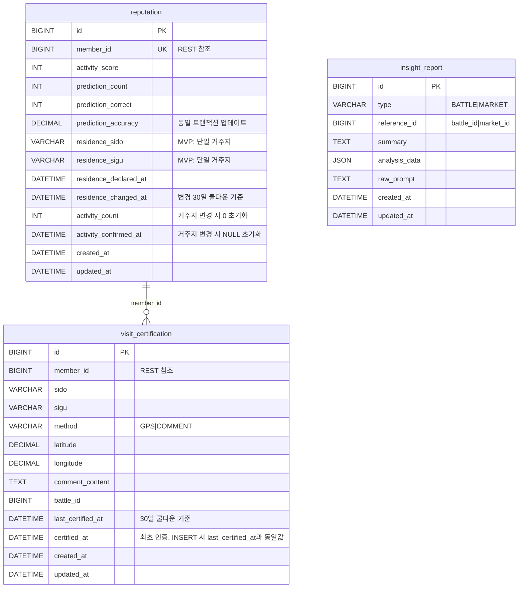

# docs/insight-reputation/ERD_ver2.md

> Insight-Reputation Service의 데이터베이스 설계 문서  
> v2: activity_count 컬럼 추가, certified_at 주석 보강, prediction_accuracy 업데이트 정책 명시, VARCHAR 허용값 주석 명시

---

## 변경 내역 (ERD_ver1.md → ERD_ver2.md)

| 테이블 | 변경 내용 |
|---|---|
| `reputation` | `activity_count INT NOT NULL DEFAULT 0` 추가 (거주지역 변경 시 `activity_confirmed_at`과 함께 초기화) |
| `reputation` | `prediction_accuracy` 3개 컬럼 동일 트랜잭션 업데이트 정책 비즈니스 제약에 추가 |
| `visit_certification` | `certified_at` DDL 주석 보강 (INSERT 시 `last_certified_at`과 동일값 세팅 명시) |
| `visit_certification` | `method` VARCHAR 허용값 주석 명시 |
| `insight_report` | `type` VARCHAR 허용값 주석 명시 |

---

## 1. 테이블 목록 및 역할

| 테이블 | 역할 |
|---|---|
| `reputation` | 회원별 신뢰도 점수 및 거주지역 선언 |
| `visit_certification` | GPS/댓글 기반 방문 인증 기록 |
| `insight_report` | AI 분석 리포트 결과 저장 |

---

## 2. 테이블 스키마 (DDL)

### 2-1. reputation

```sql
CREATE TABLE reputation (
    id                      BIGINT          NOT NULL AUTO_INCREMENT,
    member_id               BIGINT          NOT NULL UNIQUE,    -- member.id 참조 (REST)
    activity_score          INT             NOT NULL DEFAULT 0,
    prediction_count        INT             NOT NULL DEFAULT 0,
    prediction_correct      INT             NOT NULL DEFAULT 0,
    prediction_accuracy     DECIMAL(5,2)    NOT NULL DEFAULT 0, -- 예측 정확도 (%). prediction_count/prediction_correct와 항상 동일 트랜잭션에서 함께 업데이트
    residence_sido          VARCHAR(50),                        -- 거주지 시/도 (MVP: 단일 거주지)
    residence_sigu          VARCHAR(50),                        -- 거주지 시/구 (MVP: 단일 거주지)
    residence_declared_at   DATETIME,                           -- 거주지 최초 선언 시점
    residence_changed_at    DATETIME,                           -- 거주지 마지막 변경 시점 (30일 쿨다운 기준)
    activity_count          INT             NOT NULL DEFAULT 0, -- 현재 거주지 기준 활동 누적 횟수 (거주지 변경 시 0으로 초기화)
    activity_confirmed_at   DATETIME,                           -- 활동 확인 배지 획득 시점 (거주지 변경 시 NULL로 초기화)
    created_at              DATETIME        NOT NULL,
    updated_at              DATETIME        NOT NULL,
    PRIMARY KEY (id),
    INDEX idx_member_id (member_id)
);
```

### 2-2. visit_certification

```sql
CREATE TABLE visit_certification (
    id                  BIGINT          NOT NULL AUTO_INCREMENT,
    member_id           BIGINT          NOT NULL,           -- member.id 참조 (REST)
    sido                VARCHAR(50)     NOT NULL,
    sigu                VARCHAR(50)     NOT NULL,
    method              VARCHAR(20)     NOT NULL,           -- VisitCertMethod 허용값: 'GPS', 'COMMENT'
    latitude            DECIMAL(10,8),                      -- GPS 인증 시 위도
    longitude           DECIMAL(11,8),                      -- GPS 인증 시 경도
    comment_content     TEXT,                               -- 댓글 기반 인증 시 내용
    battle_id           BIGINT,                             -- 댓글 기반 인증 시 연관 battle_id
    last_certified_at   DATETIME        NOT NULL,           -- 마지막 인증 시점 (30일 쿨다운 기준, Service 레이어에서 체크)
    certified_at        DATETIME        NOT NULL,           -- 최초 인증 시점. INSERT 시 last_certified_at과 동일한 값으로 세팅, 이후 재인증 시 변경하지 않음
    created_at          DATETIME        NOT NULL,
    updated_at          DATETIME        NOT NULL,
    PRIMARY KEY (id),
    UNIQUE KEY uq_member_location (member_id, sido, sigu), -- 지역당 1건 유지 (재인증 시 UPDATE)
    INDEX idx_member_id (member_id)
);
```

> **쿨다운 처리 방식**  
> DB UNIQUE 제약으로 30일을 표현할 수 없으므로 Service 레이어에서 처리한다.  
> `last_certified_at + 30일 > NOW()` 이면 재인증 거부, 가능 날짜를 응답에 포함한다.  
> 재인증 성공 시 기존 레코드를 UPDATE한다 (INSERT 아님).

### 2-3. insight_report

```sql
CREATE TABLE insight_report (
    id              BIGINT          NOT NULL AUTO_INCREMENT,
    type            VARCHAR(20)     NOT NULL,           -- InsightReportType 허용값: 'BATTLE', 'MARKET'
    reference_id    BIGINT          NOT NULL,           -- battle_id 또는 market_id
    summary         TEXT            NOT NULL,           -- AI 요약 결과
    analysis_data   JSON,                               -- 분석에 사용된 원본 데이터 (디버깅용)
    raw_prompt      TEXT,                               -- 사용한 프롬프트 (디버깅용)
    created_at      DATETIME        NOT NULL,
    updated_at      DATETIME        NOT NULL,
    PRIMARY KEY (id),
    UNIQUE KEY uq_type_reference (type, reference_id), -- 중복 리포트 생성 방지
    INDEX idx_type (type)
);
```

---

## 3. Mermaid ERD 다이어그램



---

## 4. Enum 상세

### 4-1. VisitCertMethod

```java
public enum VisitCertMethod {
    GPS,        // GPS 좌표 기반 방문 인증
    COMMENT     // 댓글 기반 방문 인증
}
```

### 4-2. InsightReportType

```java
public enum InsightReportType {
    BATTLE,     // Battle 투표 결과 분석
    MARKET      // Market 예측 데이터 분석
}
```

---

## 5. Reputation 가중치 규칙

| 인증 상태 | 가중치 | Insight 레이어 |
|---|---:|---|
| 인증 없음 | 1.0 | 전체 사용자 |
| 거주 선언만 | 1.0 | 거주 선언 레이어 |
| 거주 선언 + 활동 확인 | 1.3 | 활동 확인 레이어 |
| 방문 인증 완료 | 1.2 | 방문자 레이어 |
| 거주 선언 + 방문 인증 | 1.3 | 활동 확인 + 방문자 레이어 |

가중치는 Insight 교차분석 필터링에만 적용, Point 획득 배율에는 영향 없음.

---

## 6. AI 데이터 흐름

```
AI 분석 트리거
  → Battle/Market 원본 데이터 조회 (REST)
  → 공공 API 데이터 조회
  → Claude API 호출 (데이터를 프롬프트에 포함)
  → insight_report 저장
  → Client에 리포트 제공
```

MVP에서는 MCP를 직접 구현하지 않으며, Insight-Reputation Service가 필요한 데이터를 직접 조회한 뒤 Claude API를 호출한다.

---

## 7. 비즈니스 제약사항

### 7-1. 데이터 무결성

- `reputation.member_id`: UNIQUE 제약 (회원당 1개 Reputation)
- `visit_certification`: `(member_id, sido, sigu)` UNIQUE (지역당 1건 유지, 재인증 시 UPDATE)
- `insight_report`: `(type, reference_id)` UNIQUE (중복 리포트 방지)

### 7-2. 방문 인증 제약

- 동일 회원 + 동일 지역: `last_certified_at + 30일 > NOW()` 이면 거부 (Service 레이어)
- GPS 인증: localhost 또는 HTTPS 환경에서만 가능
- 댓글 인증: 해당 지역 Battle에 방문 경험 댓글 작성 후 신청
- 인증 반경: 지역 중심 좌표 기준 2~3km

### 7-3. 거주지역 변경 제약

- `residence_changed_at + 30일 > NOW()` 이면 변경 거부 (Service 레이어)
- 변경 성공 시 `residence_changed_at` 업데이트, `activity_count = 0`, `activity_confirmed_at = NULL` 동시 초기화

### 7-4. 활동 확인 배지

- 거주 선언한 지역의 Battle에서 투표 또는 댓글 활동 3회 누적 시 획득
- `activity_count` 증가 → 3 도달 시 `activity_confirmed_at` 업데이트 (동일 트랜잭션)
- 거주지역 변경 시 `activity_count = 0`, `activity_confirmed_at = NULL` 초기화

### 7-5. prediction_accuracy 업데이트 정책

- `prediction_count`, `prediction_correct`, `prediction_accuracy`는 항상 동일 트랜잭션에서 함께 업데이트한다.
- `prediction_accuracy = FLOOR((prediction_correct / prediction_count) * 100 * 100) / 100` (소수점 둘째 자리 버림)
- `prediction_count = 0`인 경우 `prediction_accuracy = 0`으로 유지한다.

### 7-6. AI 분석 제약

- Battle 종료 후 자동 트리거
- Market 정산 완료 후 자동 트리거
- 특정 선택지 추천 금지 (정보 요약만 제공)
